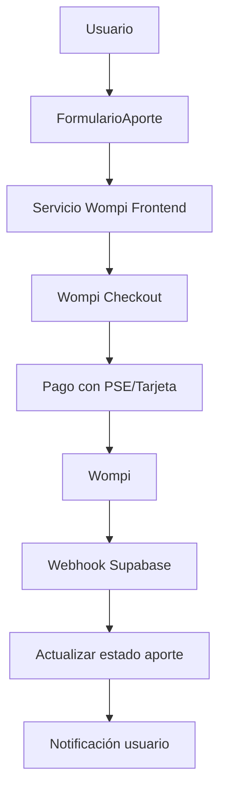

# Plan de Implementación: Pasarela de Pagos Wompi

## Resumen del Proyecto

Implementar una pasarela de pagos utilizando **Wompi** (Bancolombia) para procesar aportes monetarios a proyectos sociales en Colombia.

## Arquitectura General



## Requisitos Previos

### 1. Cuenta Wompi Developer
- Registrar cuenta en https://dev.wompi.co
- Obtener credenciales:
  - `PUBLIC_KEY` (ambiente de desarrollo)
  - `PRIVATE_KEY` (ambiente de desarrollo)
  - `EVENTS_SECRET` (para webhooks)

### 2. Configuración Supabase
- Edge Functions para comunicación con Wompi
- Webhook endpoint para confirmación de pagos
- Tabla adicional para transacciones de Wompi

## Pasos de Implementación

### Fase 1: Configuración de Variables de Entorno

```bash
VITE_WOMPI_PUBLIC_KEY=pub_test_xxxxxxxxxxxxxxxxxxxxxxxx
VITE_WOMPI_ENVIRONMENT=sandbox  # o 'production'
```

### Fase 2: Tipos de Datos

```typescript
// src/types/wompi.ts

export interface WompiTransaction {
  id: string;
  reference: string;
  amount_in_cents: number;
  currency: string;
  status: 'PENDING' | 'APPROVED' | 'DECLINED' | 'ERROR' | 'VOIDED';
  payment_method_type: 'PSE' | 'CARD' | 'NEQUI' | 'BANK_TRANSFER';
  customer_email?: string;
  created_at: string;
}

export interface WompiPaymentRequest {
  reference: string;
  amountInCents: number;
  currency: string;
  customerEmail: string;
  customerName: string;
  projectId: string;
  projectName: string;
}
```

### Fase 3: Servicio de Wompi

```typescript
// src/lib/wompi.ts

import type { WompiPaymentRequest } from '../types/wompi';

const WOMPI_API_URL = 'https://sandbox.wompi.co/v1';
const PUBLIC_KEY = import.meta.env.VITE_WOMPI_PUBLIC_KEY;

export async function createPaymentLink(request: WompiPaymentRequest): Promise<string> {
  // Crear transacción en Wompi y obtener URL de checkout
}

export async function getTransactionStatus(transactionId: string): Promise<WompiTransaction> {
  // Consultar estado de transacción
}
```

### Fase 4: Componente de Pago Wompi

```tsx
// src/components/WompiPayment.tsx

interface WompiPaymentProps {
  amount: number;
  reference: string;
  customerEmail: string;
  onSuccess: (transactionId: string) => void;
  onError: (error: string) => void;
}

export function WompiPayment({ amount, reference, customerEmail, onSuccess, onError }: WompiPaymentProps) {
  // Integrar widget de Wompi
}
```

### Fase 5: Integración con FormularioAporte

```tsx
// src/components/FormularioAporte.tsx

// Cambiar flujo:
// 1. Usuario completa formulario
// 2. Click en "Pagar con Wompi"
// 3. Redirigir a checkout Wompi
// 4. Wompi redirige de vuelta con resultado
// 5. Guardar aporte confirmado en Supabase
```

### Fase 6: Webhook para Confirmaciones

```typescript
// supabase/functions/wompi-webhook/index.ts

// Endpoint que recibe notificaciones de Wompi
// cuando el pago es aprobado
```

## Plan de Implementación Detallado

### Paso 1: Crear archivo de configuración Wompi
- Crear `src/lib/wompi.ts` con funciones de API
- Crear `src/types/wompi.ts` con interfaces

### Paso 2: Configurar Edge Functions en Supabase
- Crear función para crear transacciones
- Crear función para webhook

### Paso 3: Actualizar FormularioAporte
- Agregar selector de método de pago (PSE, Tarjeta, Nequi)
- Integrar widget de Wompi

### Paso 4: Manejo de estados
- PENDIENTE → cuando se inicia pago
- APROBADO → cuando Wompi confirma pago
- RECHAZADO → cuando pago falla

### Paso 5: Notificaciones
- Email de confirmación
- Actualización en tiempo real

## Métrodos de Pago Soportados

| Método | Descripción | Estado |
|--------|-------------|--------|
| PSE | Débito banco Colombia | ✅ |
| Tarjeta Crédito | Visa, Mastercard, American Express | ✅ |
| Nequi | Billetera digital | ✅ |
| Transferencia | Bancolombia | ✅ |

## Consideraciones de Seguridad

1. **Never expose private keys** - Usar solo en Edge Functions
2. **Validar webhooks** - Verificar firma de Wompi
3. ** idempotencia** - Evitar duplicados
4. **HTTPS** - Requerido en producción

## Próximos Pasos

1. [ ] Obtener credenciales de Wompi Developer
2. [ ] Configurar variables de entorno
3. [ ] Crear tipos TypeScript
4. [ ] Implementar servicio Wompi
5. [ ] Crear Edge Functions
6. [ ] Integrar en FormularioAporte
7. [ ] Probar en ambiente sandbox
8. [ ] Configurar webhook
9. [ ] Ir a producción

## Preguntas Pendientes

1. ¿Deseas recibir pagos en USD además de COP?
2. ¿Necesitas soporte para pagos recurrentes?
3. ¿Tienes dominio SSL para callback?
